# Fernando_Mendes-180031864
Problema 1 - Substituir a nota do laboratório

Problema 1: Uma instalação de bombeamento tem apresentado problemas em uma seção de tubulação de 1 metro de comprimento e 40 mm de diâmetro. A perda de carga foi medida usando sensores de pressão, e mensurou-se uma queda de pressão de 2 Pa. A bomba que supre esta tubulação com água está operando em potência máxima. Também mediu-se a vazão deste escoamento, obtendo um valor de 0,0001 metro cúbico por segundo na saída do tubo. O projeto de CFD deve:

- Determinar se estes valores de vazão e perda de carga estão coerentes ou não, e o motivo para isto.
- Apresentar possibilidades de problemas em caso dos valores colocados acima não estarem coerentes.
- Usando a simulação apresentada, realizar um estudo paramétrico da tensão cisalhante na parede do tubo para avaliar se o cenário acima é normal ou não para esta instalação.

## 1. Modelagem
### Objetivo do Projeto
O principal objetivo do projeto é realizar um estudo numérico de uma tubulação aplicada no bombeamento de água. A ferramenta de simulação escolhida para a realização do estudo é o Ansys CFX, pois foi uma das apresentadas pelo professor da disciplina de Dinâmica dos Fluidos. Dessa forma, será possível confrontar os dados obtidos através dos sensores de pressão visando avaliar a coerência dos mesmos. Caso haja alguma divergência significativa, haverá uma discussão sobre pontos que podem explicar tal discrepância.

### Requisitos
##### Requisito #01: Determinar a vazão
Obter o valor da vazão na saída do tubo para o cenário descrito no problema acima.

##### Requisito #02: Determinar a perda de carga
Obter o valor de perda de carga para o cenário descrito no problema acima.

##### Requisito #03: Análise dos resultados obtidos
Após obter-se os resultados da simulação, é necessário avaliar se os valores estão coerentes com os valores medidos. Caso não estejam, serão apresentados provavéis motivos da discrepância entre o experimental e o simulado.

##### Requisito #04: Estudo paramétrico da tensão cisalhante
Avaliar o impacto da variação da tensão cisalhante nas demais variáveis presentes no modelo computacional.

### Finalidade do Projeto
A finalidade do projeto é acadêmica, isto é, visa prover uma conhecimento extra à disciplina de Dinâmica dos Fluidos por meio do uso da Dinâmica dos Fluidos Computacional (CFD). Essa é uma ferramenta oriunda da tecnologia de Engenharia Assistada por Computador (CAE) a qual possibilita da análise básica até sistemas complexos [[1]](https://www.esss.co/blog/qual-a-importancia-do-engenheiro-na-simulacao-computacional/). Desse modo, a técnica apresenta uma forma de simplificação de projetos amplamente difundida na academia e indústria. O profissional responsável pela realização dos estudos matemáticos é conhecido como Engenheiro de Simulação. 

### Prazo do Projeto
O projeto será dividido em 3 partes: Modelagem, Pré-Processamento e Processamento. Na etapa de Processamento está implicito a análise dos resultados obtido nas simulações. A estimativa inicial é que o projeto dure 3 semanas, sendo 1 semana para cada parte, no entanto, o prazo está sujeito à alterações devido a relevância dos feedbacks apresentados pelo professor após a conclusão de cada parte.

### Hipóteses de Simplificação
Antes de iniciar qualquer tipo de simulação é imprescindível atentar-se para o fenômeno físico em si visando avaliar quais hipóteses de simplificação podem ser aplicadas no cenário. Adotar ou não essa hipóteses está relacionado com a influência nos parâmetros a serem analisados, a precisão necessária nos resultados, o poder computacional envolvido e o tempo disponível para realização do estudo.

Neste projeto, tendo em vista as considerações feitas, as seguintes hipóteses podem ser adotadas: 
- Escoamento incompressível;
- Escoamento laminar;
- Escoamento plenamente desenvolvido;
- A rugosidade do material da tubulação é desprezível;
- A tubulação não apresenta flanges;
- A troca de calor é desprezível.

Neste estudo, todas as hipóteses de simplificação citadas serão adotadas, porém cabe ressalva quanto a não influência do material na perda de carga. Portanto, caso os resultados não sejam condizentes com os experimentais encontrados deve-se refazer as simulações desconsiderando tal simplificação.

### Precisão do Cálculo
Em um projeto de CFD, a precisão necessária é um ponto importante, pois impactará diretamente na qualidade e quantidade dos elementos de malha, no poder de processamento necessário e no tempo de simulação. Além disso, quando o estudo é feito com viés acadêmico a precisão é rigorosamente maior do que em análises de cunho industrial.

Logo, para esta análise adotar-se-á precisão condizente com o necessário em uma indústria. Por fim, durante o pré-processamento é possivel configurar em qual patamar os resíduos, que no contexto de métodos númericos consiste no erro numério de arredondamento ou truncamento, serão considerados convergidos, nesse caso, usar-se-á 10^-4.

### Metodologia
Neste contexto, a utilização de CFD disponta como uma estratégia a ser utilizada, pois permite mudanças ágeis e que não envolvem custos financeiros. Além disso, ao optar-se pela instalação de sensores, caso mal executada, poderiam causar erro nas medições. Então, tendo em vista o cenário e as variáveis a serem estudadas nota-se que a simulação computacional é a metodoliga mais adequada.

Desse modo, para realizar a simulação será usado o software comercial Ansys Workbench 19.2, a geometria do problema usará o SpaceClaim, ferramenta de modelagem 3D do Ansys já incoporada ao Workbench 19.2, como solver adotar-se-á o CFX, no qual também é possível realizar o pós-processamento.

### Geometria
Como mencionado anteriormente, a geometria a ser estudada representa a região de escoamento plenamente desenvolvido que situa-se imediatamente ao comprimento de entrada, região caracterizada por um fluxo não uniforme, vide <a href="#fig-schematics">Fig. 1</a>. Em seguida,apresenta-se a geometria da tubulação construída no SpaceClaim, conforme as dimensões especificadas, nas <a href="#fig-isometric">Fig. 2</a>,<a href="#fig-side">Fig. 3</a> e <a href="#fig-top">Fig. 4</a>. 

  
  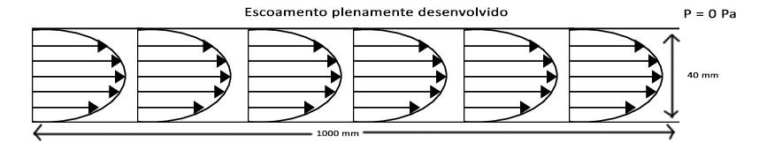

<b>Figura 1 - Esquemático da geometria</b>

  
  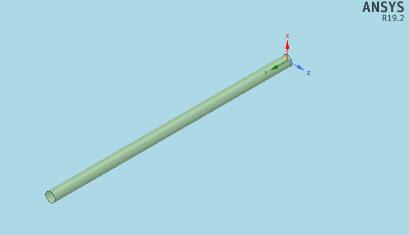

<b>Figura 2 - Vista isométrica da geometria</b>

  
  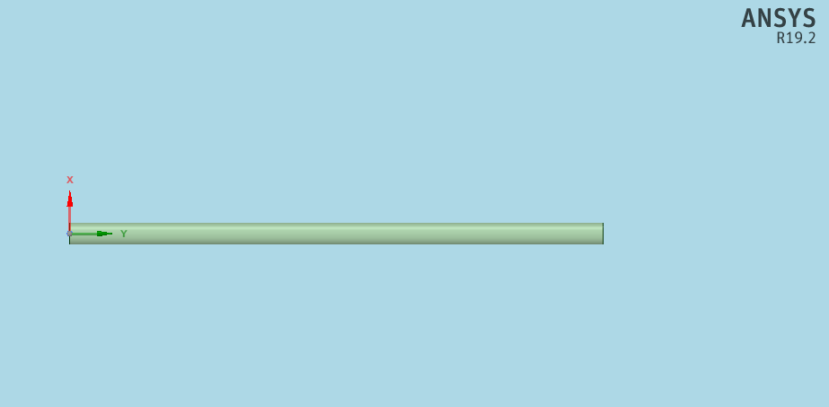

<b>Figura 3 - Vista lateral da geometria</b>

  
  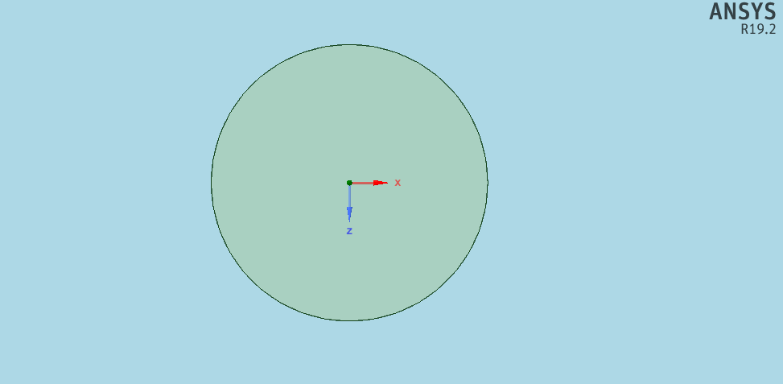

<b>Figura 4 - Vista frontal da geometria</b>

## 2. Pré-Processamento

### Geometria e Domínio de Cálculo
De acordo com o objetivo do projeto, é possível realizar uma simplificação da geometria do problema. Dessa forma, podemos desconsiderar a existência de chanfros, de ressaltos, de dimunuições no diâmetro da tubulação, de flanges, de parafusos, a relevância da espessura de tubos e de especificação do metal do tubo.Logo, a geometria utilizada será um cilindro perfeito.

### Malha
Por trata-se de uma análise inicial será utilizada a malha padrão do Ansys, gerada ao clicar em "Generate Mesh". Como a geometria do problema é simples e será um estudo de engenharia não é necessário alterar as demais configurações envolvidas. Logo, é esperado que a malha gerada pelo software seja do tipo estrutuda.

  
  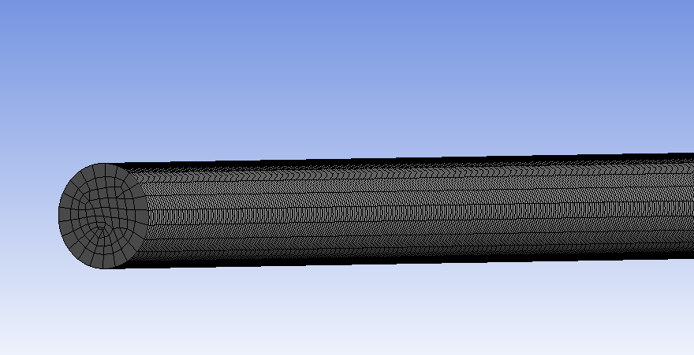

<b>Figura 5 - Malha de cálculo</b>

Além disso, após ter a malha gerada, é imprescindível nomear as faces circulares (base e topo do cilindro) como entrada e saída. Essa configuração será utilizada posteriormente para informar parâmetros como velocidade do escoamento e pressão relativa. Por padrão, o Ansys entende que as faces não nomeadas se tratam de paredes, tal fato condiz com esta análise, pois a face lateral equivale as paredes da tubulação. Então, a estrátegia utilizada será a de Volumes Finitos.

### Setup
##### Input #1: Fluido de Trabalho
Logo ao abrir o setup do CFX, o primeiro passo é configurar as opções no menu Default Domain, ou, em português, Domínio Padrão. Nele, o primeiro input necessário é o fluido de trabalho que, para essa simulação, será água, cujas propriedades já constam na biblioteca do Ansys. A <a href="#input_fluid">Fig. 6</a> ilustra essa configuração.

  
  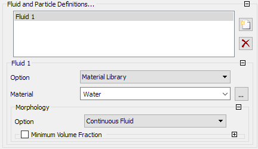

<b>Figura 6 - Configuração do fluido</b>

##### Input #2: Modelos do Domínio
Após o primeiro input, deve-se configurar a pressão de referência, 1 atm, e desativar o modelo de flutuabilidade, pois a simulação não considerará os efeitos da gravidade no escoamento. As demais opções serão mantidas conforme o padrão do CFX-Pré.

  
  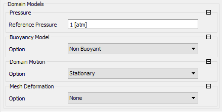

<b>Figura 7 - Configuração de propriedades do domínio</b>

##### Input #3: Modelos do Fluido
Está seção é considerada uma das mais importantes para obter-se uma simulação condizente com a realidade física esperada. Tamanha relevância está diretamente associada as hipóteses de simplificação adotadas anteriormente. Como mostrado na <a href="#input_fluid_models">Fig. 8</a>, a temperatura será mantida constante em 25 °C e o modelo k-epsilon será mantido em suas configurações padrão.

  
  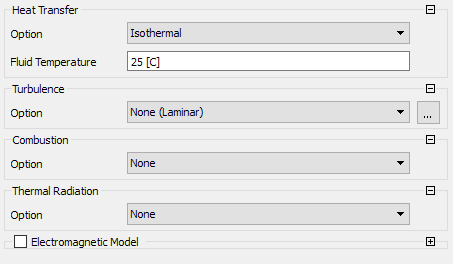

<b>Figura 8 - Configuração de propriedades do escoamento</b>

##### Input #4: Velocidade do Escoamento
O próximo passo necessário é configurar a velocidade do escoamento na região da entrada. Logo, para determiná-la deve-se utilizar a equação da vazão volumétrica tendo em vista o valor da vazão volumétrica na saída do tubo descrita pelo problema.

  
  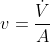

<b>Equação 1 - Velocidade do escoamento</b>

Então, da <a href="#eq-velocity">Eq. 1</a>, a velocidade usada para simulação será de 0.0795 m/s. Tendo em mente a necessidade do estudo paramétrico da Tensão Cisalhante na parede do tubo, essa velocidade foi definida como um parâmetro de entrada, com valor inicial mencionado acima, denominado "flowVel", conforme mostrado pela <a href="#input_fluid_models">Fig. 9</a>.

  
  

<b>Figura 9 - Velocidade do escoamento</b>

#### Input #5: Pressão na saída
Por fim, dentro do setup do Ansys CFX, é possível configurar a pressão na sáida do tubo relativa a pressão na entrada de forma a facilitar o cálculo da perda de carga. Portanto, ao atribuir o valor de 0 Pa o valor calculado pelo software, na entrada da tubulação, já será a queda de pressão.

  
  

<b>Figura 10 - Pressão relativa na saída</b>

### Capacidade Computacional
O poder de processamento é algo preponderante para os prazos de estudo numérico computacional de dinâmica dos fluidos, portanto, nesse contexto, em grandes projetos é comum usar-se clusters, comumente conhecidos como supercomputadores. No entanto, para esse projeto não se dispõe de tamanha capacidade computacional, a configuração do computador utilizado está descrita na tabela abaixo. 

| Item | Especificação |
| ---- | ------------- |
| Processador | Intel® Core™ i5-8250U 1.6 GHz |
| RAM | 8GB DDR4 2133 MHz |
| Placa de Vídeo | GeForce MX 150 |

Por fim, está previsto o prazo de 1 semana para a realização e avaliação das simulações feitas na etapa de processamento.

## 3. Processamento

O primeiro passo do processamento é a análise do histórico de convergência da solução. Nesta simulação, conforme <a href="#residuals">Fig. 11</a>, o histórico de convergência do cálculo está adequado, porém,  as últimas iterações apresentaram um comportamento inesperado.

Logo, tal fato indica uma ressalva quanto aos resultados quantitativos, pois o patamar resíduos RMS de 10e-4, em CFD, é tido como vagamente convergente [[4]](https://www.engineering.com/DesignSoftware/DesignSoftwareArticles/ArticleID/9296/3-Criteria-for-Assessing-CFD-Convergence.aspx). Portanto, para obtenção de resultados quantitativos, é imprescindível o reprocessamento da solução utilizando um patamar de resíduos menor.

  
  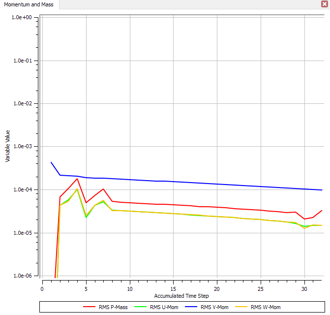

<b>Figura 11 - Gráfico da evolução dos resíduos</b>

Embora não seja capaz de fornecer resultados quantitativos de maneira confiável, esta simulação é capaz de prover uma análise qualitativa do fenômento físico. Utilizando o recurso de paralelização, a solução está levando 50 segundos para atingir a convergência. 

## 4. Pós-Processamento
Ao fim da simulação, as seguintes variáveis foram calculadas: número de Reynolds do escoamento, vazão volumétrica, queda de pressão e tensão cisalhante na parede da tubulação. Desse modo, os valores serão apresentados na tabela abaixo.

|Reynolds do Escoamento| Vazão volumétrica (m³/s) | Queda de Pressão (Pa)| Tensão Cisalhante (Pa)|
| --- | ---- | ---- | ----| 
| 3573 | 9.95e-5 | 1.432 | 0.0143 |

Com isso, segundo descrito em (Çengel), escoamentos com Reynolds maior ou igual a 2300 já são considerados em regime de transição entre laminar e turbulento. Portanto, o tipo de processamento utilizado não é condizente com a realidade física estudada. Logo, os resultados não estão de acordo com a realidade física do escoamento e nem com os dados mensurados pelo problema. 

  
  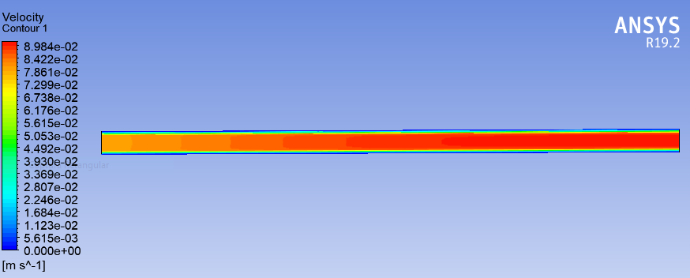

<b>Figura 12 - Contorno de velocidade</b>

  
  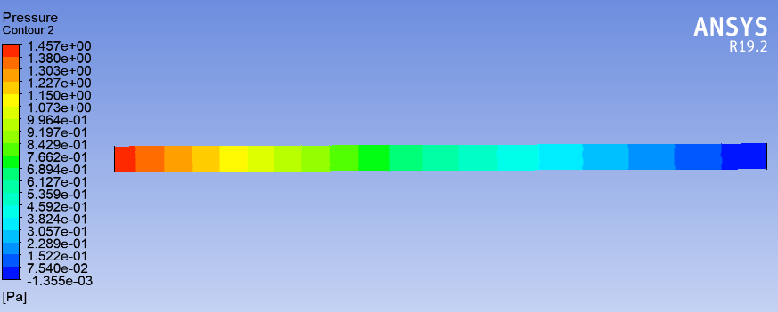

<b>Figura 13 - Contorno de pressão</b>

Na <a href="#velocity_contour">Fig. 12</a> é possível observar que o escoamento encontra-se plenamente desenvolvido antes da metade da tubulação. Desse modo, no contexto de ecoamento laminar, o perfil de velocidade nessa região é dado por uma parábola, porém, tal fato não é verificado, vide <a href="#velocity_profile">Fig. 14</a>.

  
  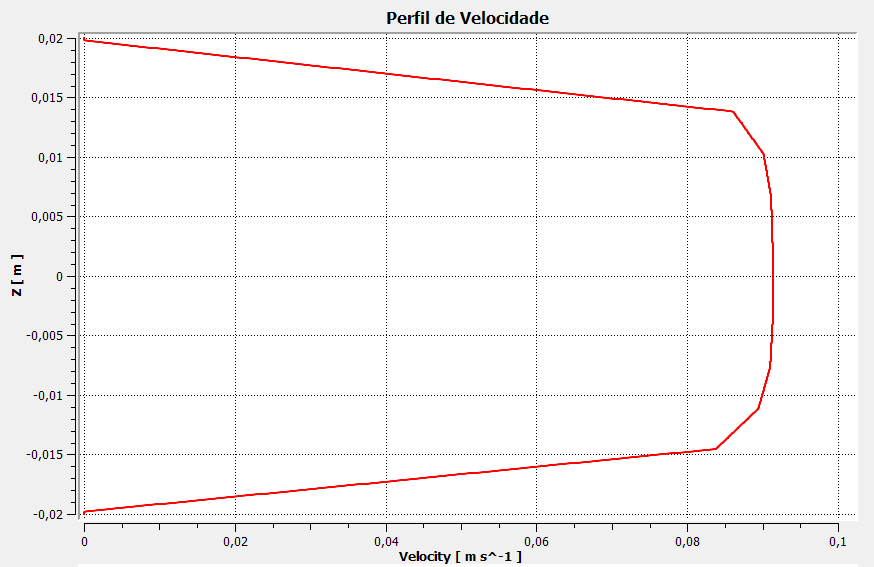

<b>Figura 14 - Perfil de velocidade no meio da tubulação</b>

  
  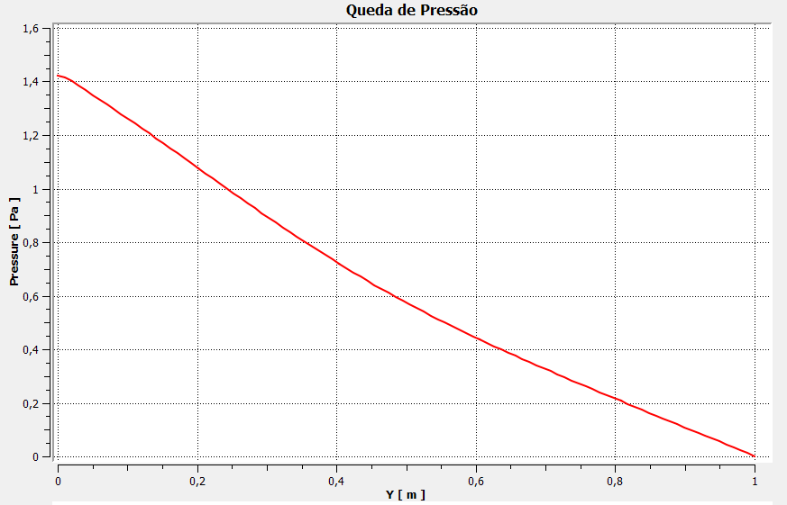

<b>Figura 15 - Queda de pressão ao longo da tubulação</b>

Utilizando a linguagem Python, calculou-se a queda de pressão teórica para o caso que está sendo estudado. No regime de transição, o fator de atrito foi estimado em f = 0.042 usando o Diagrama de Moody. Desse modo, os valores obtidos serão ilustrados na tabela abaixo.

| Variável | Fornecido | Teórico Laminar | Teórico Transição |
| -------- | --------- | --------------- | ----------------- |
| Queda de Pressão  | 2 Pa | 1.41 Pa | 3.31 Pa |

### Estudo Paramétrico

Além disso, foi conduzido um estudo paramétrico com as dimensões da tubulação, onde radius representa o raio e len representa o incremento ao tamanho inicial de 1000 mm, visando melhor entender o comportamento da queda de pressão. Porém, ao fim da análise, concluiu-se que a tubulação apresenta algum problema, pois os valores não são condizentes.

  
  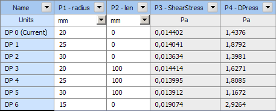

<b>Figura 16 - Estudo paramétrico</b>
