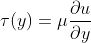

# Fernando_Mendes-180031864
Problema 1 - Substituir a nota do laboratório

Problema 1: Uma instalação de bombeamento tem apresentado problemas em uma seção de tubulação de 1 metro de comprimento e 40 mm de diâmetro. A perda de carga foi medida usando sensores de pressão, e mensurou-se uma queda de pressão de 2 Pa. A bomba que supre esta tubulação com água está operando em potência máxima. Também mediu-se a vazão deste escoamento, obtendo um valor de 0,0001 metro cúbico por segundo na saída do tubo. O projeto de CFD deve:

- Determinar se estes valores de vazão e perda de carga estão coerentes ou não, e o motivo para isto.
- Apresentar possibilidades de problemas em caso dos valores colocados acima não estarem coerentes.
- Usando a simulação apresentada, realizar um estudo paramétrico da tensão cisalhante na parede do tubo para avaliar se o cenário acima é normal ou não para esta instalação.

## 1. Modelagem
### Objetivo do Projeto
O principal objetivo do projeto é realizar um estudo numérico de uma tubulação aplicada no bombeamento de água. A ferramenta de simulação escolhida para a realização do estudo é o Ansys CFX, pois foi uma das apresentadas pelo professor da disciplina de Dinâmica dos Fluidos. Dessa forma, será possível confrontar os dados obtidos através dos sensores de pressão visando avaliar a coerência dos mesmos. Caso haja alguma divergência significativa, haverá uma discussão sobre pontos que podem explicar tal discrepância.
### Requisitos
##### Requisito #001: Vazão
No contexto de dinâmica dos fluidos, é comum encontra-se os conceitos de vazão volumétrica e vazão mássica. Ambas estão correlacionadas a velocidade do escoamento do fluido, desse modo, da teoria do fluxo de Couette [[2]](https://en.wikipedia.org/wiki/Couette_flow) conclui-se a relação entre a tensão de cisalhamento e a velocidade, ilustrado na equação abaixo.

  

##### Requisito #002: Perda de Carga
Ao fim da simulação é imprescindível ter o valor da perda de carga para possibilitar uma comparação com o valor experimental afim de determinar se o cenário estudado está coerente com o fenômeno físico esperado.

##### Requisito #003: Tensão de Cisalhamento
O estudo paramétrico da Tensão de Cisalhamento deve avaliar como ela varia em relação aos demais parâmetros.

### Finalidade do Projeto
A finalidade do projeto é acadêmica, isto é, visa prover uma conhecimento extra à disciplina de Dinâmica dos Fluidos por meio do uso da Dinâmica dos Fluidos Computacional (CFD). Essa é uma ferramenta oriunda da tecnologia de Engenharia Assistada por Computador (CAE) a qual possibilita a análise básica até sistemas complexos [[1]](https://www.esss.co/blog/qual-a-importancia-do-engenheiro-na-simulacao-computacional/). Desse modo, o projeto apresenta uma forma de simplificação de projetos amplamente difundida na academia e indústria. O profissional responsável pela realização dos estudos matemáticos é conhecido como Engenheiro de Simulação. 

### Prazo do Projeto
O projeto será dividido em 3 partes: Modelagem, Pré-Processamento e Processamento. Na etapa de Processamento está implicito a análise dos resultados obtido e de demais parâmetros inerentes as simulações de Dinâmica dos Fluidos. A estimativa inicial é que o projeto dure 3 semanas, sendo 1 semana para cada parte, no entanto, o prazo está sujeito à alterações devido a relevância dos feedbacks apresentados pelo professor após a conclusão de cada parte.

### Hipóteses de Simplificação
Antes de inicializar qualquer tipo de simulação é imprescindível atentar-se para o fenômeno físico em si visando avaliar quais hipóteses de simplificação podem ser aplicadas no cenário. Adotar ou não essa hipóteses está associado com a influência nos parâmetros a serem analisados, a precisão necessária nos resultados, o poder computacional envolvido, o tempo disponível para realização do estudo.

Nesse projeto, tendo em vista as considerações acimas, algumas hipóteses podem ser adotadas como escoamento incompressível, laminar e plenamente desenvolvido, a rugosidade do material não afeta a perda de carga e não existem flanges. Nesse estudo, todas as hipóteses de simplificação citadas serão adotadas, porém cabe ressalva quanto a não influência do material na perda de carga. Portanto, caso os resultados não sejam condizentes com os experimentais encontrados deve-se refazer as simulações desconsiderando tal simplificação.

### Precisão
Em um projeto de CFD, a precisão necessária é um ponto importante, pois impactará diretamente na qualidade e quantidade dos elementos de malha. Além disso, quando o estudo é feito com viés acadêmico a precisão costuma ser rigorosamente maior do que em análises de cunho industrial. Logo, para essa análise adotará-se precisão condizente com o necessário em uma indústria. Por fim, durante o pré-processamento é possivel configurar em qual patamar os resíduos serão considerados convergidos, nesse caso, usará-se 10^-5.

### Metodologia
Nesse contexto, a utilização de CFD disponta como uma estratégia a ser utilizada, pois permite mudanças ágeis e que não envolvem custos financeiros. Além disso, ao optar-se pela instalação de sensores, caso mal executada, pode ocasionar erros nas medições a serem realizadas. Portando, tendo em vista o cenário e as variáveis a serem estudadas nota-se que é a metodoliga mais adequada.

### Geometria
A geometria a ser estudada será apresentada abaixo.

  

<b>Figura 1 - Vista isométrica da geometria</b>

  

<b>Figura 2 - Vista lateral da geometria</b>

  

<b>Figura 3 - Vista forntal da geometria</b>

Além disso, o esquemático do problema será apresentado abaixo.

  

<b>Figura 4 - Esquemático da geometria</b>

