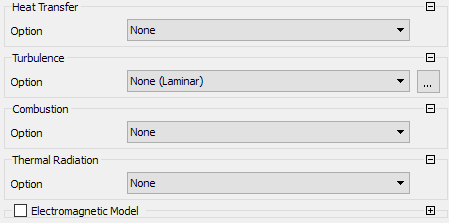
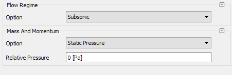

# Fernando_Mendes-180031864
Problema 1 - Substituir a nota do laboratório

Problema 1: Uma instalação de bombeamento tem apresentado problemas em uma seção de tubulação de 1 metro de comprimento e 40 mm de diâmetro. A perda de carga foi medida usando sensores de pressão, e mensurou-se uma queda de pressão de 2 Pa. A bomba que supre esta tubulação com água está operando em potência máxima. Também mediu-se a vazão deste escoamento, obtendo um valor de 0,0001 metro cúbico por segundo na saída do tubo. O projeto de CFD deve:

- Determinar se estes valores de vazão e perda de carga estão coerentes ou não, e o motivo para isto.
- Apresentar possibilidades de problemas em caso dos valores colocados acima não estarem coerentes.
- Usando a simulação apresentada, realizar um estudo paramétrico da tensão cisalhante na parede do tubo para avaliar se o cenário acima é normal ou não para esta instalação.

## 1. Modelagem
### Objetivo do Projeto
O principal objetivo do projeto é realizar um estudo numérico de uma tubulação aplicada no bombeamento de água. A ferramenta de simulação escolhida para a realização do estudo é o Ansys CFX, pois foi uma das apresentadas pelo professor da disciplina de Dinâmica dos Fluidos. Dessa forma, será possível confrontar os dados obtidos através dos sensores de pressão visando avaliar a coerência dos mesmos. Caso haja alguma divergência significativa, haverá uma discussão sobre pontos que podem explicar tal discrepância.

### Requisitos
##### Requisito #01: Determinar a vazão
Obter o valor da vazão na saída do tubo para o cenário descrito no problema acima.

##### Requisito #02: Determinar a perda de carga
Obter o valor de perda de carga para o cenário descrito no problema acima.

##### Requisito #03: Análise dos resultados obtidos
Após obter-se os resultados da simulação, é necessário avaliar se os valores estão coerentes com os valores medidos. Caso não estejam, serão apresentados provavéis motivos da discrepância entre o experimental e o simulado.

##### Requisito #04: Estudo paramétrico da tensão cisalhante
Avaliar o impacto da variação da tensão cisalhante nas demais variáveis presentes no modelo computacional.

### Finalidade do Projeto
A finalidade do projeto é acadêmica, isto é, visa prover uma conhecimento extra à disciplina de Dinâmica dos Fluidos por meio do uso da Dinâmica dos Fluidos Computacional (CFD). Essa é uma ferramenta oriunda da tecnologia de Engenharia Assistada por Computador (CAE) a qual possibilita da análise básica até sistemas complexos [[1]](https://www.esss.co/blog/qual-a-importancia-do-engenheiro-na-simulacao-computacional/). Desse modo, a técnica apresenta uma forma de simplificação de projetos amplamente difundida na academia e indústria. O profissional responsável pela realização dos estudos matemáticos é conhecido como Engenheiro de Simulação. 

### Prazo do Projeto
O projeto será dividido em 3 partes: Modelagem, Pré-Processamento e Processamento. Na etapa de Processamento está implicito a análise dos resultados obtido nas simulações. A estimativa inicial é que o projeto dure 3 semanas, sendo 1 semana para cada parte, no entanto, o prazo está sujeito à alterações devido a relevância dos feedbacks apresentados pelo professor após a conclusão de cada parte.

### Hipóteses de Simplificação
Antes de iniciar qualquer tipo de simulação é imprescindível atentar-se para o fenômeno físico em si visando avaliar quais hipóteses de simplificação podem ser aplicadas no cenário. Adotar ou não essa hipóteses está relacionado com a influência nos parâmetros a serem analisados, a precisão necessária nos resultados, o poder computacional envolvido e o tempo disponível para realização do estudo.

Neste projeto, tendo em vista as considerações feitas, as seguintes hipóteses podem ser adotadas: 
- Escoamento incompressível;
- Escoamento laminar;
- Escoamento plenamente desenvolvido;
- A rugosidade do material da tubulação é desprezível;
- A tubulação não apresenta flanges;
- A troca de calor é desprezível.

Neste estudo, todas as hipóteses de simplificação citadas serão adotadas, porém cabe ressalva quanto a não influência do material na perda de carga. Portanto, caso os resultados não sejam condizentes com os experimentais encontrados deve-se refazer as simulações desconsiderando tal simplificação.

### Precisão do Cálculo
Em um projeto de CFD, a precisão necessária é um ponto importante, pois impactará diretamente na qualidade e quantidade dos elementos de malha, no poder de processamento necessário e no tempo de simulação. Além disso, quando o estudo é feito com viés acadêmico a precisão é rigorosamente maior do que em análises de cunho industrial.

Logo, para esta análise adotar-se-á precisão condizente com o necessário em uma indústria. Por fim, durante o pré-processamento é possivel configurar em qual patamar os resíduos, que no contexto de métodos númericos consiste no erro numério de arredondamento ou truncamento, serão considerados convergidos, nesse caso, usar-se-á 10^-4.

### Metodologia
Neste contexto, a utilização de CFD disponta como uma estratégia a ser utilizada, pois permite mudanças ágeis e que não envolvem custos financeiros. Além disso, ao optar-se pela instalação de sensores, caso mal executada, poderiam causar erro nas medições. Então, tendo em vista o cenário e as variáveis a serem estudadas nota-se que a simulação computacional é a metodoliga mais adequada.

Desse modo, para realizar a simulação será usado o software comercial Ansys Workbench 19.2, a geometria do problema usará o SpaceClaim, ferramenta de modelagem 3D do Ansys já incoporada ao Workbench 19.2, como solver adotar-se-á o CFX, no qual também é possível realizar o pós-processamento.

### Geometria
Como mencionado anteriormente, a geometria a ser estudada representa a região de escoamento plenamente desenvolvido que situa-se imediatamente ao comprimento de entrada, região caracterizada por um fluxo não uniforme, vide <a href="#fig-schematics">Fig. 1</a>. Em seguida,apresenta-se a geometria da tubulação construída no SpaceClaim, conforme as dimensões especificadas, nas <a href="#fig-isometric">Fig. 2</a>,<a href="#fig-side">Fig. 3</a> e <a href="#fig-top">Fig. 4</a>. 

  
  

<b>Figura 1 - Esquemático da geometria</b>

  
  

<b>Figura 2 - Vista isométrica da geometria</b>

  
  

<b>Figura 3 - Vista lateral da geometria</b>

  
  

<b>Figura 4 - Vista frontal da geometria</b>

## 2. Pré-Processamento

### Domínio de Cálculo

O domínio de cálculo é essencial para a obtenção de resultados condizentes com a realidade, pois é a representação da região em que a simulação será realizada. Desse modo, é imprescindível que tal domínio tenha uma boa precisão visando representar fielmente particularidades da geometria a ser estudada. No contexto de CFD, a malha representa o domínio de cálculo, isto é, o numero e o tamanho das subdivisões está diretamente relacionado a precisão do cálculo. Portanto, o refinamento da malha é uma etapa bastante relevante e demorada, no geral, avalia-se a precisão do cálculo por meio da análise de convergência da malha e dos indicadores de qualidade obtidos pelo software, como Skewness e Orthogonal Quality.

|   | Tamanho do Elemento (m) | Skewness Máximo (Médio) | Orthogonal Quality Mínimo (Médio) | Vazão (m^3 s^-1) | Perda de Carga (Pa) |
|---|-------------------------|-------------------------|-----------------------------------|------------------|---------------------|
| 1 | 9e-3                    | 0,38046 (0,24283)       | 0,90712 (0,96754)                 | 9,44963E-05      | 1,32482             |
| 2 | 8e-3                    | 0,35696  (0,21308)      | 0,67941 (0,96602)                 | 9,21612E-05      | 1,53159             |
| 3 | 7e-3                    | 0,43229  (0,26281)      | 0,65656 (0,94135)                 | 9,12663E-05      | 1,64314             |
| 4 | 6e-3                    | 0,39218  (0,1707)       | 0,76694 (0,99761)                 | 9,8576E-05       | 2,13076             |
| 5 | 5e-3                    | 0,43317  (0,22576)      | 0,67294 (0,95308)                 | 9,38992E-05      | 2,10196             |

Com isso, tendo em vista a tabela acima, nota-se que para o quinto tamanho de elemento as variáveis obtidas da simulação apresentam pouca variação. Tal fato indica que o tamanho ideal de elemento foi encontrado e, além disso, que a geometria está condizente com a situação física. Por fim, optou-se por trabalhar com uma malha estruturada por exigir menos memória computacional e devido a geometria ser bastante simples.

### Setup

Visando determinar, com base na teoria descrita em (ÇENGEL), os valores da velocidade do escoamento, do número de Reynolds e da queda de pressão foi desenvolvido um código em Python a partir da vazão volumétrica informada pelo problema e das dimensões do tubo. 

| Variável | Valor Teórico|
| -------- | -------------|
|Velocidade do escoamento (m/s) | 0.0795|
|Reynolds | 3565.8 |
|Queda de pressão (Pa) | 3.31|  

<b>Tabela 1 - Resultados obtidos pelo código</b>

Com esse código notou-se que para a vazão volumétrica informada, o escoamento encontra-se na região de transição, pois o Reynolds está entre 2300 e 4000. Logo, a hipótese de escoamento previamente laminar previamente adotada foi refutada e algum modelo de turbulência precisará ser adotado. Portanto, com base no discutido em [[2]](https://www.researchgate.net/post/what_is_the_difference_between_k_epsilon_and_k_omega_models_in_CFD_and_how_does_it_affect_flow_in_a_shell_and_tube_heat_exchanger), optou-se por utilizar o modelo de turbulência k-epsilon.

##### Input #1: Fluido de Trabalho
Logo ao abrir o setup do CFX, o primeiro passo é configurar as opções no menu Default Domain, ou, em português, Domínio Padrão. Nele, o primeiro input necessário é o fluido de trabalho que, para essa simulação, será água, cujas propriedades já constam na biblioteca do Ansys. A <a href="#input_fluid">Fig. 5</a> ilustra essa configuração.

  
  

<b>Figura 5 - Configuração do fluido</b>

##### Input #2: Modelos do Domínio
Após o primeiro input, deve-se configurar a pressão de referência, 1 atm, e desativar o modelo de flutuabilidade, pois a simulação não considerará os efeitos da gravidade no escoamento. As demais opções serão mantidas conforme o padrão do CFX-Pré.

  
  

<b>Figura 6 - Configuração de propriedades do domínio</b>

##### Input #3: Modelos do Fluido
Está seção é considerada uma das mais importantes para obter-se uma simulação condizente com a realidade física esperada. Tamanha relevância está diretamente associada as hipóteses de simplificação adotadas anteriormente. Como mostrado na <a href="#input_fluid_models">Fig. 7</a>, a temperatura será mantida constante em 25 °C e o modelo k-epsilon será mantido em suas configurações padrão.

  
  

<b>Figura 7 - Configuração de propriedades do escoamento</b>

##### Input #4: Velocidade do Escoamento
O próximo passo necessário é configurar a velocidade do escoamento no software. Logo, para determiná-la deve-se utilizar a equação da vazão volumétrica tendo em vista o valor da vazão volumétrica na saída do tubo descrita pelo problema.

  
  

<b>Equação 1 - Velocidade do escoamento</b>

Então, da <a href="#eq-velocity">Eq. 1</a>, a velocidade usada, apresentada na  <a href="#tab-codigo">Tabela 1</a>,para simulação será de 0.0795 m/s. Tendo em mente a necessidade do estudo paramétrico da Tensão Cisalhante na parede do tubo, essa velocidade foi definida como um parâmetro de entrada, com valor inicial mencionado acima, denominado "flowVel", conforme mostrado pela <a href="#eq-velocity">Fig. 8</a>.

  
  

<b>Figura 8 - Velocidade do escoamento</b>

#### Input #5: Pressão na saída
Por fim, dentro do setup do Ansys CFX, é possível configurar a pressão na sáida do tubo relativa a pressão na entrada de forma a facilitar o cálculo da perda de carga. Portanto, ao atribuir o valor de 0 Pa o valor calculado pelo software, naquele local, já será a queda de pressão na tubulação.

  
  

<b>Figura 9 - Pressão relativa na saída</b>

### Capacidade Computacional
O poder de processamento é algo preponderante para os prazos de estudo numérico computacional de dinâmica dos fluidos, portanto, nesse contexto, em grandes projetos é comum usar-se clusters, comumente conhecidos como supercomputadores. No entanto, para esse projeto não se dispõe de tamanha capacidade computacional, a configuração do computador utilizado está descrita na tabela abaixo.

| Item | Especificação |
| ---- | ------------- |
| Processador | Intel® Core™ i5-8250U 1.6 GHz |
| RAM | 8GB DDR4 2133 MHz |
| Placa de Vídeo | GeForce MX 150 |